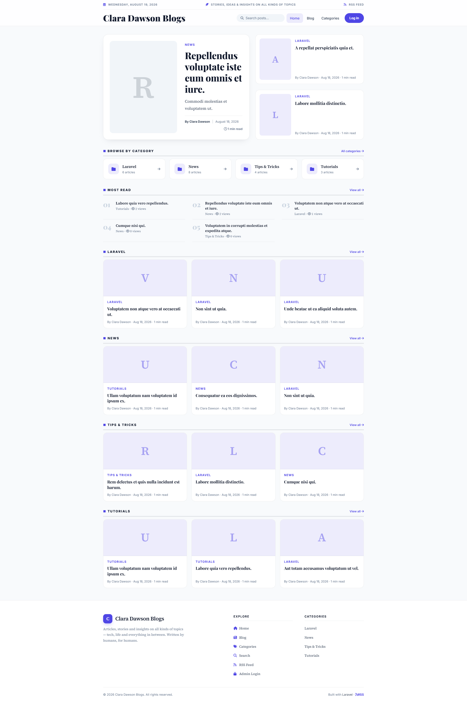
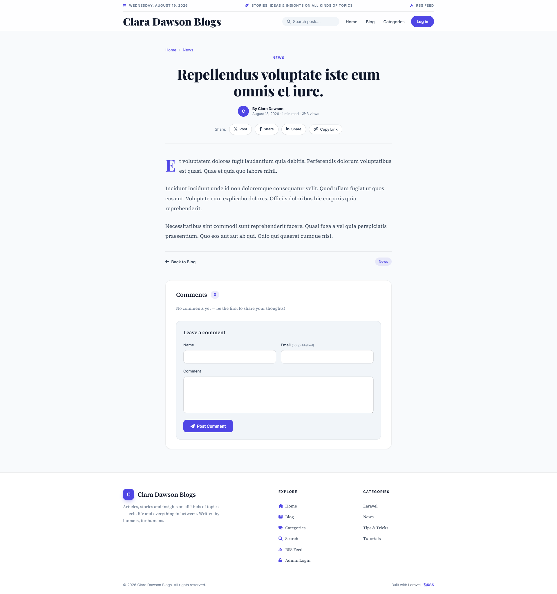
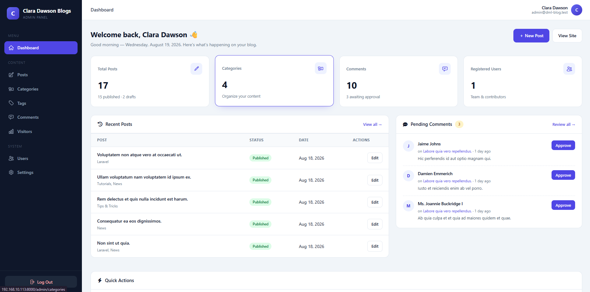
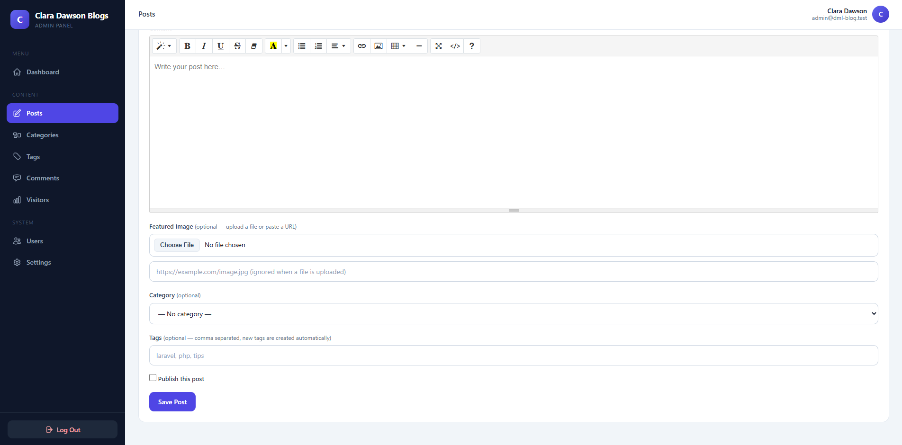
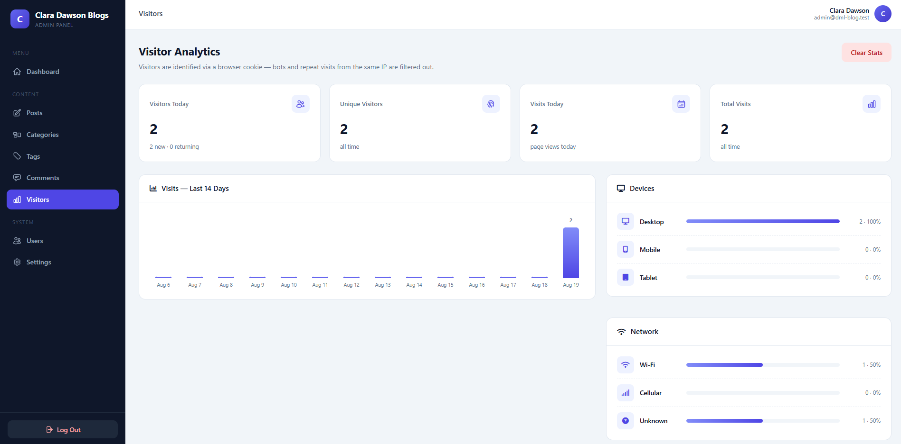

# Laravel Personal Blog

A complete Laravel blog with custom admin panel, SEO, tags, post views and visitor analytics — built from scratch, no packages.

This codebase powers **Clara Dawson Blogs**, a single-author newspaper-style blog. One install gives you the public site, the admin panel and analytics.

## What's included

**Public site**

- Newspaper-style homepage with category sections and a most-read list
- Infinite scroll with loading skeletons
- Search
- Categories and tags with archive pages
- Comments with a moderation queue
- Per-post view counters (bots excluded)
- RSS feed, sitemap and robots.txt
- SEO meta tags, Open Graph, Twitter cards and JSON-LD
- Responsive down to 390 px

**Admin panel**

- Custom session login with throttling and remember me
- Dashboard with live stats, recent posts and pending comments
- Post editor (Summernote), featured image upload, drafts, auto slugs, tags
- Category, tag and comment management
- User management
- Settings pages for general options and SEO
- Visitor analytics: unique visitors, new vs returning, bot filtering, IP dedupe, 14-day chart, device and network breakdown, top locations, recent visits

## Screenshots

Homepage:



Post page:



Admin dashboard:



Post editor:



Visitor analytics:



## Requirements

- PHP 8.3+
- Composer
- MySQL or SQLite

## Installation

```bash
git clone https://github.com/yourname/laravel-personal-blog.git
cd laravel-personal-blog
composer install
cp .env.example .env
php artisan key:generate
```

Set your database credentials in `.env`, then:

```bash
php artisan migrate --seed
php artisan storage:link
php artisan serve
```

Open http://127.0.0.1:8000. The seeder creates the admin user, sample posts, categories and comments.

## Default login

- Email: `admin@dml-blog.test`
- Password: `password`

Change it under Admin > Users after logging in, or edit `database/seeders/DatabaseSeeder.php`.

## Customizing

- Site name, tagline and posts per page: Admin > Settings
- SEO defaults (description, keywords, share image, robots directive, Google/Bing verification): Admin > Settings > SEO
- Blog title in the browser tab: `APP_NAME` in `.env`

## Tests

```bash
php artisan test
```

72 tests covering authentication, content management, SEO, view counters and visitor analytics.

## How visitor tracking works

1. Every public page view passes through the `TrackVisit` middleware.
2. Bots (Googlebot, crawlers, curl, etc.) are detected from the user agent and ignored.
3. A 2-year `visit_token` cookie identifies each visitor. Repeat requests within 30 minutes are deduplicated, with IP as the fallback for cookieless clients.
4. The browser's Network Information API reports Wi-Fi vs cellular after page load.
5. IP geolocation (country, region, city) is fetched and cached. Private IPs like localhost are skipped.
6. Returning visitors are labeled new or returning in the admin.

## Project structure

```
app/Http/Controllers/   public blog, admin panel, auth, visit ping
app/Http/Middleware/    TrackVisit (analytics)
app/Models/             Post, Category, Tag, Comment, User, Setting, Visit
database/migrations/    schema
database/seeders/       default admin and sample content
resources/views/admin/  admin pages
resources/views/blog/   public pages and partials
public/css/             blog and admin stylesheets
public/js/              infinite scroll, mobile nav, network ping
docs/screenshots/       screenshots used in this README
```

## Routes

| URL | Page |
|---|---|
| `/` | Homepage |
| `/blog` | All posts |
| `/categories` and `/tags/{slug}` | Archive pages |
| `/posts/{slug}` | Article |
| `/search`, `/feed`, `/sitemap.xml` | Search, RSS, sitemap |
| `/login` | Admin login |
| `/admin` | Dashboard |
| `/admin/posts`, `/admin/categories`, `/admin/tags` | Content management |
| `/admin/comments` | Comment moderation |
| `/admin/users` | User management |
| `/admin/settings`, `/admin/settings/seo` | Settings |
| `/admin/visitors` | Visitor analytics |


